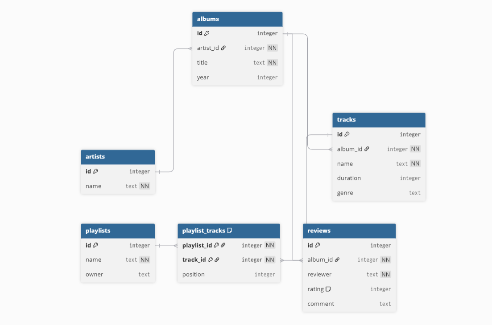

## Environment Variables

Configuration is managed via a `.env` file in the project root. Example:

```
OPENAI_API_KEY=
OLLAMA_HOST=http://localhost:11434
SQLITE_DB_PATH=data/demo_music.sqlite
```

- `OPENAI_API_KEY`: Required for OpenAI provider (leave blank if not used)
- `OLLAMA_HOST`: URL for Ollama server (default: `http://localhost:11434`)
- `SQLITE_DB_PATH`: Path to the SQLite database file

The project will load these variables automatically. If you use only local providers, you do not need to set `OPENAI_API_KEY`.
# Video Presentation

[YouTube Video](https://youtu.be/HtK9w5Sd-_4) with code execution.

The project presentation is available here: [docs/Presentation.pptx](docs/Presentation.pptx)

## Overview

This project implements a Text-to-SQL system that converts natural language questions into executable SQL queries. The system uses a multi-step pipeline with validation, schema awareness, and supports multiple LLM providers.

**Features:**
- Multi-step pipeline: schema extraction → prompt building → SQL generation → validation → execution
- Modular provider architecture: Naive (regex), OpenAI (gpt-4o-mini), Ollama (multiple models: phi3, qwen, codellama, starcoder, etc.)
- Centralized provider mapping and DRY benchmarking logic
- All Ollama models benchmarked sequentially and compared in one run
- SQL validation: syntax check + read-only enforcement + schema validation
- Few-shot learning with static examples for improved accuracy
- Evaluation metrics: Exact Match (EM), Execution Accuracy (EX), and error breakdowns
- Pretty console output with tabulated benchmark results
- Robust error handling and memory management (Ollama models are unloaded after use)
- Cross-platform: works on Linux, Windows, and in VS Code (tasks.json provided)

## Architecture

**Pipeline Steps:**
1. Extract database schema
2. Build prompt with few-shot examples
3. Generate SQL using selected provider
4. Validate SQL (syntax + schema checks)
5. Execute query and summarize results

## Providers

- **naive**: Simple rule-based baseline, not schema-aware.
- **openai**: Uses OpenAI gpt-4o-mini
- **ollama-phi3**: Local LLM (phi3:medium)
- **ollama-qwen**: Local LLM (qwen2.5:7b)
- **ollama-codellama**: Local LLM (codellama:7b)
- **ollama-hrida**: Local LLM (HridaAI/hrida-t2sql-128k:latest)
- **ollama-deepseek**: Local LLM (deepseek-coder:6.7b)
- **ollama-duckdb**: Local LLM (duckdb-nsql:7b)

All providers dynamically use the schema context for SQL generation. Provider selection and benchmarking are modular, with all Ollama models handled automatically.

## Data Model

Demo database (`demo_music.sqlite`):
## Database Schema Diagram



Sample data: 20 artists, 20 albums, 38+ tracks, playlists, reviews, etc.

## Core Implementation

**TextToSQLChain** (`src/chain/text_to_sql.py`):
```python
from src.chain.text_to_sql import TextToSQLChain
chain = TextToSQLChain()
sql, rows, summary = chain.run(
    "How many tracks?",
    provider_name="ollama",  # or "openai", "naive"
    db_path="data/demo_music.sqlite"
)
print("SQL:", sql)
print("Results:", rows)
print("Summary:", summary)
```

**SQL Validation** (`src/validation/sql_validator.py`):
- Syntax check via sqlglot parser
- Read-only enforcement (SELECT only)
- Schema validation (tables/columns)

## Setup & Usage

### Installation (Linux/macOS):
```bash
git clone https://github.com/dvmizew/DumiDom.git
cd DumiDom
python3 -m venv .venv
source .venv/bin/activate
make install
make init-db
```

### Installation (Windows):
```powershell
git clone https://github.com/dvmizew/DumiDom.git
cd DumiDom
python -m venv .venv
.\.venv\Scripts\Activate.ps1   # sau .venv\Scripts\activate.bat pentru cmd
make.bat install
make.bat init-db
```

### Usage (Windows):
```powershell
make.bat help                 # Show available commands
make.bat run                  # Run demo query
make.bat benchmark-compare    # Run benchmark on all providers
make.bat clean                # Remove cache files and artifacts
```

### CLI Examples (universal):
```bash
python -m src.cli "How many tracks?" --provider naive
python -m src.cli "Show artists" --provider ollama-qwen
python -m src.cli "Show albums" --provider ollama-phi3
```

## Evaluation Results

Latest benchmark (2026-01-22) on 17 Spider-style queries (all providers, all Ollama models):

| Provider           | EM    | EX    | Syntax Err   | Logic Err   | Exec Err   |
|--------------------|-------|-------|--------------|-------------|------------|
| naive              | 5.9%  | 11.8% | 0.0%         | 88.2%       | 0.0%       |
| ollama-codellama   | 5.9%  | 94.1% | 0.0%         | 5.9%        | 0.0%       |
| ollama-deepseek    | 5.9%  | 88.2% | 5.9%         | 5.9%        | 0.0%       |
| ollama-duckdb      | 5.9%  | 29.4% | 5.9%         | 64.7%       | 0.0%       |
| ollama-hrida       | 5.9%  | 35.3% | 11.8%        | 52.9%       | 0.0%       |
| ollama-phi3        | 5.9%  | 88.2% | 0.0%         | 11.8%       | 0.0%       |
| ollama-qwen        | 17.6% | 100.0%| 0.0%         | 0.0%        | 0.0%       |
| openai             | 0.0%  | 0.0%  | 0.0%         | 0.0%        | 100.0%     |

## Project Structure


```
.
|-- Makefile                # Unix automation (build, benchmark, etc.)
|-- make.bat                # Windows automation (mirrors Makefile targets)
|-- requirements.txt        # Python dependencies
|-- README.md               # Documentation
|-- scripts/
|   |-- benchmark_compare.py    # Main benchmarking script
|   |-- init_demo_db.py         # Demo SQLite DB and sample data generator
|-- src/
|   |-- cli.py                  # CLI entry point (text-to-SQL, feedback)
|   |-- providers/
|   |   |-- base.py
|   |   |-- naive_provider.py
|   |   |-- openai_provider.py
|   |   |-- ollama_provider.py
|   |   |-- ollama-*.py         # Ollama LLM providers (phi3, qwen, codellama, etc.)
|   |-- db/
|   |   |-- sqlite_db.py
|   |-- eval/
|   |   |-- benchmark.py
|   |-- validation/
|   |   |-- sql_validator.py
|-- data/
|   |-- demo_music.sqlite       # Demo SQLite database
|-- eval/
|   |-- spider_sample.json      # Evaluation queries
|   |-- feedback.jsonl          # User feedback for few-shot learning
|-- benchmark_results/
|   |-- benchmark_results.md    # Markdown summary of results
|   |-- results.csv             # CSV results
|   |-- results_details.json    # Detailed results
```

## Dependencies

- Python 3.8+
- sqlglot (SQL parsing)
- openai (OpenAI API)
- ollama (Ollama API)
- python-dotenv (environment config, optional; no longer required for Ollama)
- tabulate (output formatting)
- tqdm (progress bars)

---

## Originality Statement

This project (code and documentation) is original and created for academic requirements. It does not contain sections copied from other sources without citation. Any code, text, or idea taken from external sources is properly cited. The project complies with the ethics and academic integrity rules of FMI.

## AI Usage

AI tools (GitHub Copilot, ChatGPT) were used for code generation, explanations, and documentation structuring, as permitted by the assignment. All AI tools and sources used are listed in the References section.

## References

[1] OpenAI, GPT-4 Technical Report, https://openai.com/research/gpt-4

[2] Yu, Tao, et al., Spider: A Large-Scale Human-Labeled Dataset for Complex and Cross-Domain Semantic Parsing and Text-to-SQL Task, EMNLP 2018, https://arxiv.org/abs/1809.08887

[3] sqlglot Documentation, https://sqlglot.com

[4] OpenAI, ChatGPT, https://chatgpt.com/

[5] Copilot, https://copilot.microsoft.com